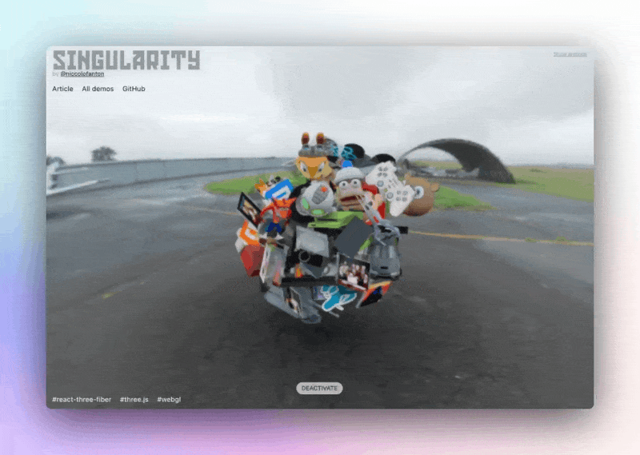

# Title of the demo

"SINGULARITY" demo for the tutorial on optimizing complex Three.js scenes while preserving quality



[Article on Codrops](https://tympanus.net/codrops/?p=)

[Demo](https://tympanus.net/Development/.../)

## Installation

Install dependencies:

```
npm install --force
```

Compile the code for development and start a local server:

```
npm run dev
```

Create the build:

```
npm run build
```

## Credits

- ADD 3D MODELS CREDITS!!!!

## Misc

Follow *Niccolò Fanton*: [Twitter](https://x.com/niccolofanton), [Instagram](https://www.instagram.com/niccolofanton), [GitHub](https://github.com/niccolofanton) 

Follow Codrops: [Bluesky](https://bsky.app/profile/codrops.bsky.social), [Facebook](http://www.facebook.com/codrops), [GitHub](https://github.com/codrops), [Instagram](https://www.instagram.com/codropsss/), [X](http://www.x.com/codrops)

## License
[MIT](LICENSE)

Made with :blue_heart:  by [Codrops](http://www.codrops.com)


